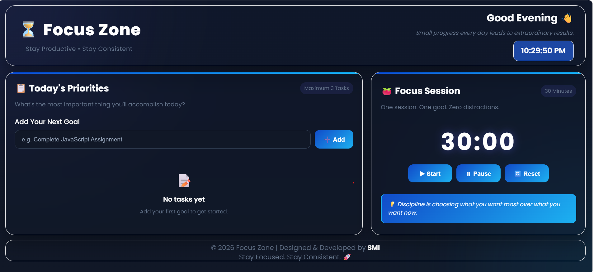

# Focus Zone

A simple productivity dashboard built with HTML, CSS, and JavaScript.

## Preview

## Features

- Task management
- Pomodoro focus timer
- Live clock and greeting
- Task progress tracking
- Responsive design
- Empty task state

## Technologies

- HTML5
- CSS3
- JavaScript

## Purpose

Built as a practical frontend project to improve JavaScript, DOM manipulation, event handling, and responsive UI development.
